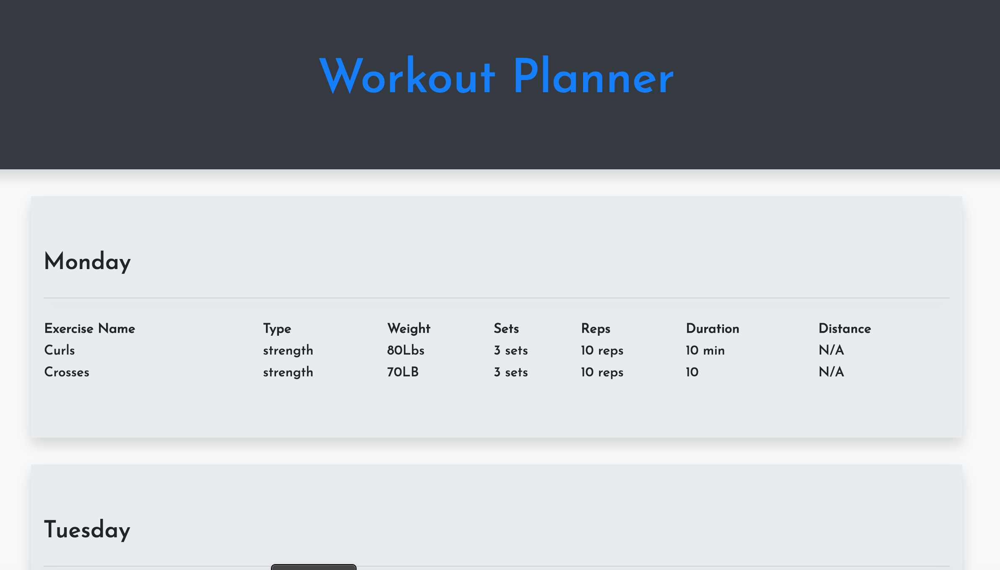
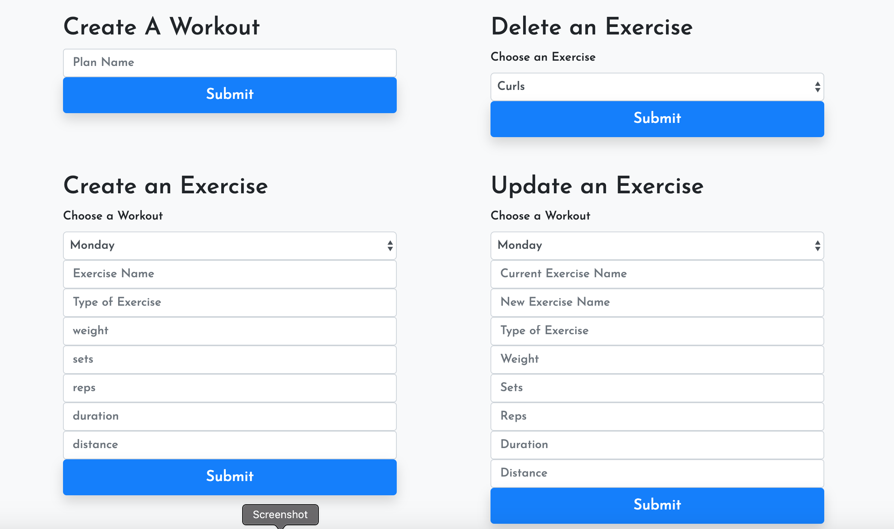

# Workout Planner 
    

## Description
    With this app, the user can track her workouts. Exercises can be added, updated, or deleted from each workout. The app is running an Express server and uses a Mongo database built with Mongoose Schema. It's deployed on Heroku at the website listed above. Thanks for checking it out.

    

  

